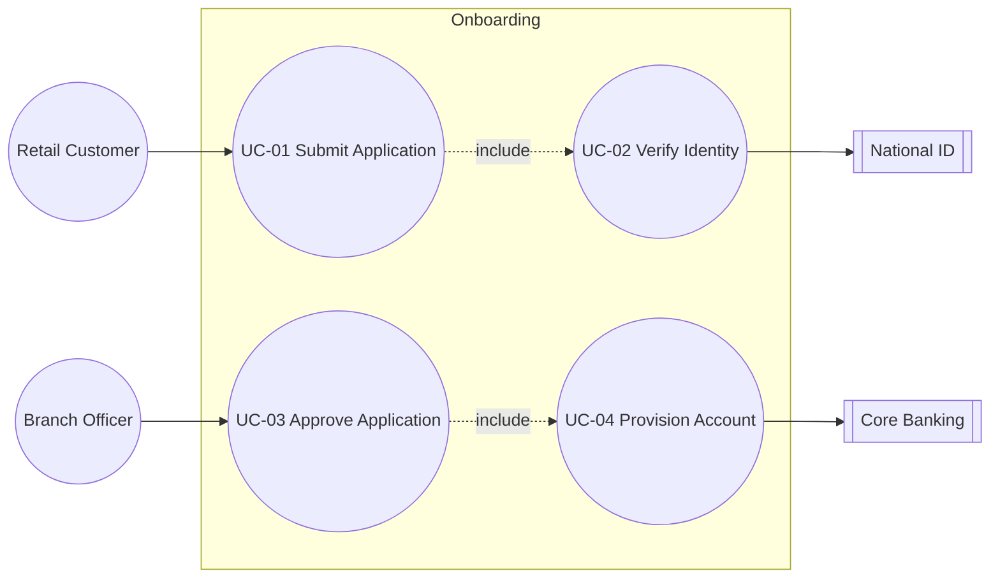

<!--
Template: use_cases — Use Cases & User Stories / Trường hợp Sử dụng & Câu chuyện Người dùng
Standard: UML 2.5 Use Case + Unified Process (Cockburn fully-dressed) + Gherkin AC
Skill:    banking-docs
Version:  2.0.0
Usage:    node scripts/build_doc.js <folder> --brand <vendor> --client <client>
-->

# Trường hợp Sử dụng & Câu chuyện Người dùng / Use Cases & User Stories

**Project**: {{facts.project.name}} — {{facts.project.code}}
**Client**: {{facts.client.name}}
**Vendor**: {{facts.vendor.name}}
**Version**: {{facts.doc.version}}
**Date**: {{facts.doc.date}}
**Classification**: {{facts.doc.classification}}

> This document follows the UML 2.5 Use Case notation and the Cockburn fully-dressed format for detailed flows. Acceptance Criteria use Gherkin Given/When/Then, the standard for BDD-aligned QA.

<!-- PAGE_BREAK -->

## 1. Tác nhân & Persona / Actors & Personas

<!-- FILL: Identify every actor that interacts with the system. Distinguish primary (initiates the goal) from supporting (provides a service). -->

**What goes here**:
- Human actors with role + segment + goal
- System actors (other systems consuming or providing)
- Personas (richer than actors — include motivation, frustrations, tech literacy)
- Trust level (anonymous, authenticated, privileged)

**Actor catalogue**:

| ID | Actor | Type | Trust Level | Primary Goal |
|---|---|---|---|---|
| A1 | Retail Customer | Human (primary) | Authenticated | Open account on mobile |
| A2 | Branch Officer | Human (primary) | Privileged | Approve high-risk applications |
| A3 | Compliance Officer | Human (supporting) | Privileged | Review AML alerts |
| A4 | Core Banking System | System | Trusted internal | Provision CIF + accounts |
| A5 | National ID Service | System | Trusted external | Verify ID document |
| <!-- FILL --> | <!-- FILL --> | <!-- FILL --> | <!-- FILL --> | <!-- FILL --> |

**Persona snapshot** (one example, expand as needed):

| Attribute | Persona: "Linh — Young Professional" |
|---|---|
| Age / Segment | 28 / Mass affluent |
| Tech literacy | High — banks via app, never visits branch |
| Goal | Open account in under 5 minutes during lunch break |
| Frustration | Re-uploading documents; OTP timeouts |
| Success signal | Activated debit card delivered within 48h |

<!-- PAGE_BREAK -->

## 2. Sơ đồ Use Case / Use Case Diagram

<!-- FILL: One UML use case diagram per major subsystem. Embed mermaid or reference an external PNG. -->

**What goes here**:
- Subsystem boundary box
- Actors arranged left (primary) and right (supporting)
- Use case ovals connected by associations
- `<<include>>` and `<<extend>>` relationships labelled

**Example (mermaid)**:



> Replace with the diagram for your project. Keep one diagram per subsystem (max 8 use cases per diagram for readability).

<!-- PAGE_BREAK -->

## 3. Mô hình Use Case / Use Case Model

<!-- FILL: Tabular index of every use case in scope. This is the master list QA, dev, and BAs all reference. -->

**Use case index**:

| UC-ID | Name | Primary Actor | Preconditions | Trigger | Postconditions | Priority |
|---|---|---|---|---|---|---|
| UC-01 | Submit Onboarding Application | Retail Customer | App installed | User taps "Open account" | Application persisted, status=PENDING | Must |
| UC-02 | Verify Identity | Retail Customer | Application exists | UC-01 reaches verify step | Identity score recorded | Must |
| UC-03 | Approve Application | Branch Officer | Application status=PENDING | Officer opens queue | Status=APPROVED or REJECTED | Must |
| UC-04 | Provision Account | System | Application APPROVED | UC-03 completes | CIF + account created in core | Must |
| UC-05 | <!-- FILL --> | <!-- FILL --> | <!-- FILL --> | <!-- FILL --> | <!-- FILL --> | <!-- FILL --> |
| UC-06 | <!-- FILL --> | <!-- FILL --> | <!-- FILL --> | <!-- FILL --> | <!-- FILL --> | <!-- FILL --> |

<!-- PAGE_BREAK -->

## 4. Use Case Chi tiết / Detailed Use Cases (Cockburn Fully-Dressed)

<!-- FILL: Provide fully-dressed detail for every "Must" use case. Include 3 sample skeletons below; replicate the pattern. -->

### 4.1 UC-01 — Submit Onboarding Application

| Field | Content |
|---|---|
| Goal | Customer submits a complete onboarding application from the mobile app |
| Scope | Customer Onboarding subsystem |
| Level | User goal |
| Primary Actor | Retail Customer (A1) |
| Stakeholders & Interests | Customer: fast, secure submission. Bank: complete data, AML evidence captured. |
| Preconditions | App installed; device passes integrity check; user accepts T&Cs |
| Success Guarantee | Application stored with status=PENDING, reference number returned |
| Trigger | User taps "Open account" on home screen |

**Main Success Scenario**:

| Step | Actor | Action |
|---|---|---|
| 1 | Customer | Selects product type (e.g., Savings) |
| 2 | System | Displays required documents and consent flow |
| 3 | Customer | Captures national ID front + back via camera |
| 4 | System | Performs OCR; pre-fills personal details |
| 5 | Customer | Confirms / corrects personal details |
| 6 | Customer | Performs liveness check (`<<include>>` UC-02) |
| 7 | System | Persists application; returns reference number |

**Extensions**:

| # | Condition | Handling |
|---|---|---|
| 4a | OCR confidence < 80% | System asks customer to retake photo |
| 6a | Liveness fails 3 times | System suspends submission; routes to branch flow |
| <!-- FILL --> | <!-- FILL --> | <!-- FILL --> |

---

### 4.2 UC-02 — Verify Identity

<!-- FILL: replicate the structure above for UC-02. -->

| Field | Content |
|---|---|
| Goal | <!-- FILL --> |
| Primary Actor | <!-- FILL --> |
| Preconditions | <!-- FILL --> |
| Success Guarantee | <!-- FILL --> |
| Trigger | <!-- FILL --> |

**Main Success Scenario**:

| Step | Actor | Action |
|---|---|---|
| 1 | <!-- FILL --> | <!-- FILL --> |
| 2 | <!-- FILL --> | <!-- FILL --> |
| 3 | <!-- FILL --> | <!-- FILL --> |

---

### 4.3 UC-03 — Approve Application

<!-- FILL: replicate. -->

| Field | Content |
|---|---|
| Goal | <!-- FILL --> |
| Primary Actor | <!-- FILL --> |
| Preconditions | <!-- FILL --> |
| Success Guarantee | <!-- FILL --> |
| Trigger | <!-- FILL --> |

**Main Success Scenario**:

| Step | Actor | Action |
|---|---|---|
| 1 | <!-- FILL --> | <!-- FILL --> |
| 2 | <!-- FILL --> | <!-- FILL --> |

<!-- PAGE_BREAK -->

## 5. Câu chuyện Người dùng / User Stories

<!-- FILL: Decompose use cases into INVEST-compliant stories suitable for sprint backlog. Include estimate column for planning. -->

**Story format**: "As a `<role>`, I want `<capability>`, so that `<benefit>`."

**Story backlog**:

| Story-ID | Linked UC | Story | Estimate (SP) | Priority |
|---|---|---|---|---|
| US-001 | UC-01 | As a retail customer, I want to capture my ID with my phone camera, so that I avoid typing personal data manually. | 5 | Must |
| US-002 | UC-01 | As a retail customer, I want to save my application as a draft, so that I can resume later if interrupted. | 3 | Should |
| US-003 | UC-02 | As a retail customer, I want a clear retry option after a failed liveness check, so that I am not blocked unnecessarily. | 2 | Must |
| US-004 | UC-03 | As a branch officer, I want a queue prioritised by application age and risk score, so that I clear the highest-risk items first. | 5 | Must |
| US-005 | <!-- FILL --> | <!-- FILL --> | <!-- FILL --> | <!-- FILL --> |
| US-006 | <!-- FILL --> | <!-- FILL --> | <!-- FILL --> | <!-- FILL --> |

<!-- PAGE_BREAK -->

## 6. Tiêu chí Chấp nhận / Acceptance Criteria (Gherkin)

<!-- FILL: Each user story carries 1-N acceptance criteria expressed in Given/When/Then. QA writes test scripts directly from these. -->

**Sample AC for US-001**:

```gherkin
Feature: Capture national ID via mobile camera
  As a retail customer
  I want to capture my ID with my phone camera
  So that I avoid typing personal data manually

  Scenario: Successful capture with high OCR confidence
    Given I am on the "Capture ID" screen
    And my device camera permission is granted
    When I capture the front of my national ID
    And the OCR confidence score is >= 80%
    Then the system pre-fills name, DoB, and ID number
    And I am routed to the "Confirm details" screen

  Scenario: Low OCR confidence triggers retake
    Given I am on the "Capture ID" screen
    When I capture the front of my national ID
    And the OCR confidence score is < 80%
    Then the system shows the message "Please retake — image unclear"
    And the captured image is discarded
```

**Sample AC for US-003**:

```gherkin
Feature: Retry liveness check after failure
  Scenario: Customer retries within attempt limit
    Given I have failed liveness check 1 time
    When I tap "Try again"
    Then I am taken back to the liveness instructions screen
    And the attempt counter increments to 2

  Scenario: <!-- FILL -->
    Given <!-- FILL -->
    When <!-- FILL -->
    Then <!-- FILL -->
```

> Replicate the Gherkin block per story. Keep scenarios under 8 steps; split if longer.

<!-- PAGE_BREAK -->

## 7. Truy vết / Traceability

<!-- FILL: Bidirectional traceability from Use Case → User Story → Functional Requirement → Test Case. Auditors expect this. -->

**Traceability matrix**:

| UC-ID | User Stories | FR-ID (from BRD) | Test Cases (TC-ID) |
|---|---|---|---|
| UC-01 | US-001, US-002 | FR-001, FR-002 | TC-001, TC-002, TC-003 |
| UC-02 | US-003 | FR-003 | TC-004, TC-005 |
| UC-03 | US-004 | FR-005, FR-006 | TC-006, TC-007 |
| UC-04 | <!-- FILL --> | <!-- FILL --> | <!-- FILL --> |
| <!-- FILL --> | <!-- FILL --> | <!-- FILL --> | <!-- FILL --> |

> The matrix is maintained in the project's ALM tool (Jira / Azure DevOps) and exported here for the baselined version.

---

**Document Control**

| Version | Date | Author | Change Summary |
|---|---|---|---|
| 0.1 | <!-- FILL --> | <!-- FILL --> | Initial use case set |
| 1.0 | {{facts.doc.date}} | {{facts.vendor.name}} | Baselined for sprint planning |
