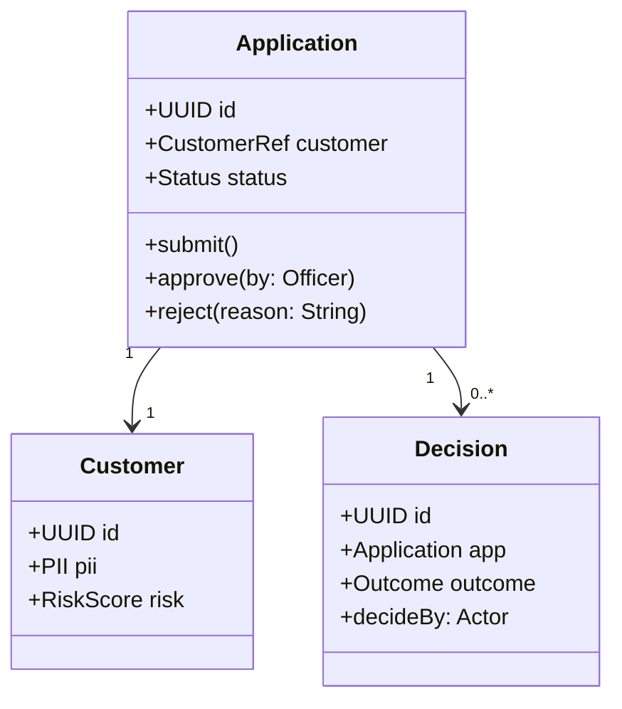
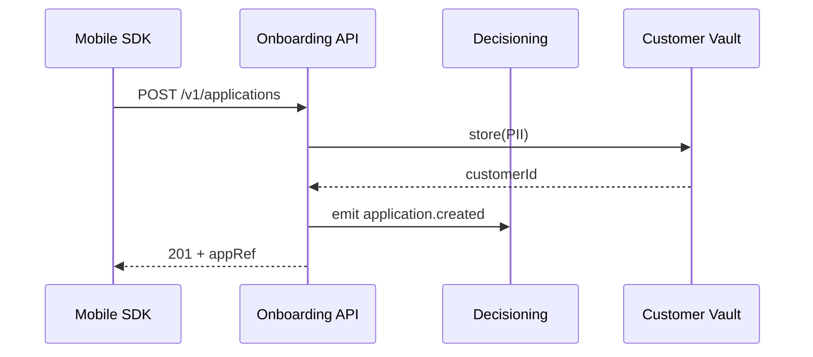
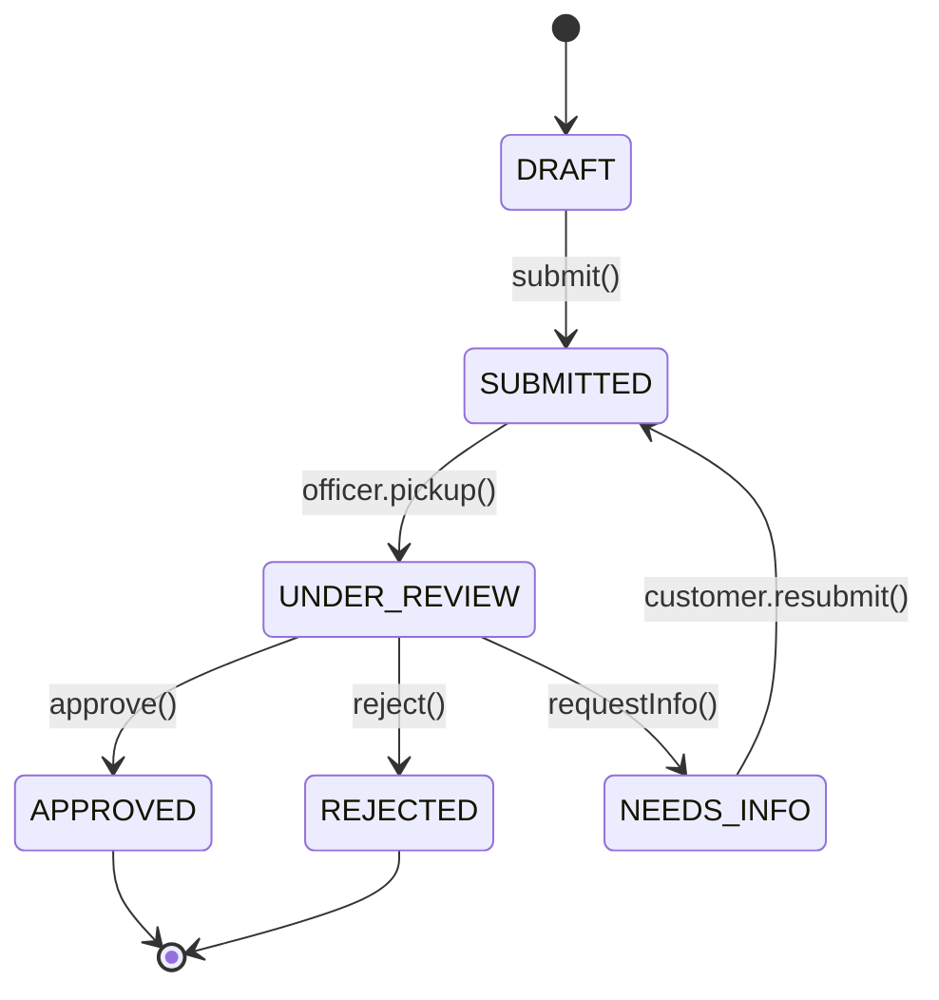

<!--
Template: lld — Low Level Design / Thiết kế Chi tiết
Standard: ISO/IEC/IEEE 42010 (Architecture Description) + UML 2.5
Skill:    banking-docs
Version:  2.0.0
Usage:    node scripts/build_doc.js <folder> --brand <vendor> --client <client>
-->

# Thiết kế Chi tiết / Low Level Design

**Project**: {{facts.project.name}} — {{facts.project.code}}
**Client**: {{facts.client.name}}
**Vendor**: {{facts.vendor.name}}
**Version**: {{facts.doc.version}}
**Date**: {{facts.doc.date}}
**Classification**: {{facts.doc.classification}}

> Per ISO/IEC/IEEE 42010, the LLD describes architecture from the developer viewpoint: components, classes, sequences, states, and the contracts between them. It is the bridge from HLD to source code. Anything ambiguous here becomes a defect later.

<!-- PAGE_BREAK -->

## 1. Tổng quan / Overview

<!-- FILL: Set the scope of this LLD. One LLD per subsystem if the system is large; one LLD covering all components if small. -->

**What goes here**:
- The subsystem(s) covered by this document
- Reference to the parent HLD section(s)
- Design principles followed (e.g., DDD, hexagonal, CQRS)
- Cross-cutting concerns deferred to other docs (security → 16, infra → 17)

**Document scope**:

| Element | Status |
|---|---|
| HLD reference | §<!-- FILL --> of {{facts.project.code}}-HLD-v<!-- FILL --> |
| Subsystems covered | <!-- FILL: e.g., Onboarding, Decisioning --> |
| Design style | <!-- FILL: e.g., Hexagonal + DDD bounded contexts --> |
| Out of scope | Infrastructure (see 17_devops.md), DB physical (see 09_dbd.md) |

<!-- PAGE_BREAK -->

## 2. Thiết kế Cấp Component / Component-Level Design

<!-- FILL: For EACH component in scope, repeat the template block below. Keep one component per subsection. -->

### 2.1 Component: `<ComponentName>`

| Attribute | Value |
|---|---|
| Responsibility | <!-- FILL: single-sentence purpose. If you can't fit in one sentence, split the component. --> |
| Bounded context | <!-- FILL --> |
| Owning team | <!-- FILL --> |
| Tech stack | <!-- FILL: e.g., Spring Boot 3.2, PostgreSQL, Kafka --> |
| Deployment unit | <!-- FILL: e.g., Docker image, K8s deployment name --> |

**Provided interfaces** (what this component exposes):

| Interface | Type | Consumer | Contract |
|---|---|---|---|
| `POST /v1/applications` | REST | Mobile SDK | See 10_api_spec §<!-- FILL --> |
| `application.created` | Kafka event | Decisioning, Audit | See schemas §6 |
| <!-- FILL --> | <!-- FILL --> | <!-- FILL --> | <!-- FILL --> |

**Required interfaces** (what this component depends on):

| Dependency | Type | Provider | Failure Mode |
|---|---|---|---|
| National ID lookup | REST (sync) | NID Adapter | Circuit-break after 3 fails / 30 s |
| Customer Vault | REST (sync) | Vault svc | Retry 2× exp backoff |
| <!-- FILL --> | <!-- FILL --> | <!-- FILL --> | <!-- FILL --> |

**Internal data model** (class-level — DB level lives in 09_dbd.md):
- See §6

**Error handling**:
- Domain errors mapped to HTTP 4xx with `application/problem+json` (RFC 9457)
- Infrastructure errors → 5xx, retried by caller per backoff policy
- See §9 for retry matrix

---

### 2.2 Component: `<NextComponentName>`

<!-- FILL: replicate the block above for every component. -->

| Attribute | Value |
|---|---|
| Responsibility | <!-- FILL --> |
| Bounded context | <!-- FILL --> |
| Owning team | <!-- FILL --> |
| Tech stack | <!-- FILL --> |
| Deployment unit | <!-- FILL --> |

<!-- PAGE_BREAK -->

## 3. Sơ đồ Lớp & Tuần tự / Class & Sequence Diagrams

<!-- FILL: One class diagram per component; one sequence diagram per critical use case (UC-IDs from 06_use_cases.md). -->

**Class diagram (mermaid example)**:



**Sequence diagram for UC-01 Submit Application (mermaid example)**:



> Provide one sequence per critical UC. Reference the UC-ID in the diagram caption.

<!-- PAGE_BREAK -->

## 4. Sơ đồ Trạng thái / State Diagrams

<!-- FILL: One state machine per stateful aggregate (e.g., Application, Loan, Card). Capture every transition trigger and guard. -->

**Application state machine**:



**Transition table** (machine-readable companion):

| From | Event | Guard | To | Side Effect |
|---|---|---|---|---|
| DRAFT | submit | All required fields present | SUBMITTED | Emit `application.submitted` |
| SUBMITTED | pickup | Officer has permission | UNDER_REVIEW | Lock app for officer |
| UNDER_REVIEW | approve | Risk score ≤ threshold | APPROVED | Trigger account provisioning |
| <!-- FILL --> | <!-- FILL --> | <!-- FILL --> | <!-- FILL --> | <!-- FILL --> |

<!-- PAGE_BREAK -->

## 5. Thuật toán Chi tiết / Algorithm Details

<!-- FILL: For non-trivial logic (scoring, fee calculation, fraud rules), provide pseudo-code. Plain English in the surrounding paragraphs explains intent. -->

**Example: risk score calculation**

Intent: produce an integer score 0-100 from a weighted combination of identity confidence, source-of-funds plausibility, and watchlist hits. Threshold for auto-approval is configurable per segment.

```text
function calculateRiskScore(app):
  s_identity   = clamp(app.identity.ocrConfidence * 100, 0, 100)
  s_liveness   = app.identity.livenessPassed ? 100 : 0
  s_watchlist  = app.aml.watchlistHits == 0 ? 100 : 0
  s_pep        = app.aml.pepStatus == 'NONE' ? 100 : 50

  weights = config.weights[app.segment]   // e.g. {id:0.3, live:0.2, wl:0.3, pep:0.2}
  score   = s_identity*weights.id
          + s_liveness*weights.live
          + s_watchlist*weights.wl
          + s_pep*weights.pep
  return round(score)
```

> Add one block per critical algorithm. Reference test cases in 12_test_plan.md that exercise edge values.

<!-- PAGE_BREAK -->

## 6. Mô hình Dữ liệu (Class-Level) / Data Models

<!-- FILL: Class-level domain model with field types and invariants. DB-level mapping lives in 09_dbd.md. -->

**Domain model summary**:

| Class | Field | Type | Constraint / Invariant |
|---|---|---|---|
| Application | id | UUID | Immutable |
| Application | submittedAt | Instant | Not null once status >= SUBMITTED |
| Application | status | enum Status | Transitions per §4 only |
| Customer | pii | PII (value object) | Encrypted at rest |
| Customer | risk | RiskScore | 0-100 inclusive |
| <!-- FILL --> | <!-- FILL --> | <!-- FILL --> | <!-- FILL --> |

**Value objects** (no identity, equality by value):

| Object | Fields | Validation |
|---|---|---|
| PII | name, dob, idNumber, address | All required; idNumber per CCCD format |
| RiskScore | int 0-100 | Bounded; immutable |
| <!-- FILL --> | <!-- FILL --> | <!-- FILL --> |

<!-- PAGE_BREAK -->

## 7. Điểm Tích hợp API / API Integration Points

<!-- FILL: Inventory of every API the components in §2 consume or expose. Cross-reference 10_api_spec.md for full contract. -->

**API integration map**:

| Direction | Component | API | Endpoint / Topic | Spec Ref |
|---|---|---|---|---|
| Inbound | Onboarding API | REST | `POST /v1/applications` | 10_api_spec §5.1 |
| Outbound | Onboarding API | REST | NID lookup | 10_api_spec §5.4 |
| Inbound | Decisioning | Kafka | `application.created` | Schemas §6 |
| Outbound | Provisioning | REST | Core banking CIF | 10_api_spec §5.7 |
| <!-- FILL --> | <!-- FILL --> | <!-- FILL --> | <!-- FILL --> | <!-- FILL --> |

<!-- PAGE_BREAK -->

## 8. Triển khai & Cấu hình / Deployment & Configuration

<!-- FILL: Component packaging, runtime configuration, env-specific overrides. Detailed pipeline lives in 17_devops.md. -->

**Deployment matrix**:

| Component | Runtime | Image | Replicas (prod) | Scaling Trigger |
|---|---|---|---|---|
| Onboarding API | JVM 21 | `registry/onboarding-api:<sha>` | 4 | CPU > 60% |
| Decisioning | JVM 21 | `registry/decisioning:<sha>` | 2 | Kafka lag > 1000 |
| <!-- FILL --> | <!-- FILL --> | <!-- FILL --> | <!-- FILL --> | <!-- FILL --> |

**Configuration parameters** (env-overridable):

| Key | Default | Description | Sensitive? |
|---|---|---|---|
| `risk.weights.retail` | `0.3,0.2,0.3,0.2` | Weights for risk algorithm | No |
| `nid.timeoutMs` | `2000` | NID lookup timeout | No |
| `vault.kmsKeyId` | _(per-env)_ | KMS key for PII encryption | Yes |
| <!-- FILL --> | <!-- FILL --> | <!-- FILL --> | <!-- FILL --> |

<!-- PAGE_BREAK -->

## 9. Xử lý Lỗi & Retry / Error Handling & Retry Logic

<!-- FILL: Standardise the error contract and retry posture across all components. Inconsistency here is a top defect source. -->

**Error response contract** (RFC 9457 problem+json):

```json
{
  "type": "https://errors.{{facts.vendor.domain}}/onboarding/duplicate-application",
  "title": "Duplicate application",
  "status": 409,
  "detail": "An application for this national ID is already in PENDING state.",
  "instance": "/v1/applications/req-7c2",
  "traceId": "abc123"
}
```

**Retry policy matrix**:

| Caller → Callee | Idempotent? | Retry | Backoff | Circuit Break |
|---|---|---|---|---|
| API → Vault | Yes (PUT by id) | 3 | Exp 100/400/1600 ms | After 5 fails / 30 s |
| API → NID | Yes (GET) | 2 | Exp 200/800 ms | After 3 fails / 30 s |
| API → Core (CIF create) | No (must use idempotency key) | 1 | n/a | After 3 fails / 60 s |
| <!-- FILL --> | <!-- FILL --> | <!-- FILL --> | <!-- FILL --> | <!-- FILL --> |

**Dead-letter handling**:
- Failed events after retries land on `<topic>.dlq`
- DLQ inspected by ops every <!-- FILL --> minutes; runbook in 18_runbook.md
- Alerts trigger when DLQ depth > <!-- FILL -->

---

**Document Control**

| Version | Date | Author | Change Summary |
|---|---|---|---|
| 0.1 | <!-- FILL --> | <!-- FILL --> | Initial draft |
| 1.0 | {{facts.doc.date}} | {{facts.vendor.name}} | Baselined for build |
