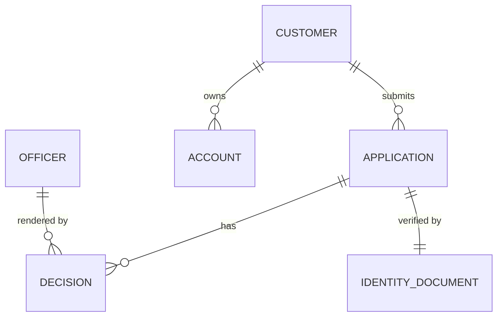

<!--
Template: dbd — Database Design / Thiết kế Cơ sở Dữ liệu
Standard: ER (Chen / Crow's Foot) + Data Dictionary per ISO/IEC 11179
Skill:    banking-docs
Version:  2.0.0
Usage:    node scripts/build_doc.js <folder> --brand <vendor> --client <client>
-->

# Thiết kế Cơ sở Dữ liệu / Database Design

**Project**: {{facts.project.name}} — {{facts.project.code}}
**Client**: {{facts.client.name}}
**Vendor**: {{facts.vendor.name}}
**Version**: {{facts.doc.version}}
**Date**: {{facts.doc.date}}
**Classification**: {{facts.doc.classification}}

> This document captures the conceptual, logical, and physical data models. It also defines the data dictionary per ISO/IEC 11179, indexing strategy, partitioning, retention, and recovery posture. DBA, dev, and audit all read this document.

<!-- PAGE_BREAK -->

## 1. Tổng quan CSDL / Database Overview

<!-- FILL: One paragraph: which database engines are used, why, and which schemas/components they back. -->

**What goes here**:
- Engines selected (OLTP, OLAP, cache, search) and rationale
- Schema-to-component mapping (one DB per bounded context, ideally)
- Replication topology (primary/replica, multi-AZ)
- Compliance constraints (data residency, encryption posture)

**Database inventory**:

| Database | Engine + Version | Purpose | Owner Component | Sizing (Y1) |
|---|---|---|---|---|
| `onboarding_db` | PostgreSQL 16 | OLTP for applications | Onboarding API | 100 GB |
| `decisioning_db` | PostgreSQL 16 | OLTP for decisions, audit trail | Decisioning | 50 GB |
| `vault_db` | PostgreSQL 16 + pgcrypto | PII at rest | Customer Vault | 80 GB |
| `analytics_dwh` | Snowflake / BigQuery | Reporting + AML analytics | Data platform | 1 TB |
| <!-- FILL --> | <!-- FILL --> | <!-- FILL --> | <!-- FILL --> | <!-- FILL --> |

<!-- PAGE_BREAK -->

## 2. Mô hình Khái niệm / Conceptual Model

<!-- FILL: Entity-relationship at the business-concept level. No keys, no datatypes — just "what things exist and how they relate". -->

**ER diagram (mermaid example)**:

**Entity glossary** (business definitions, no tech detail):

| Entity | Definition | Lifespan |
|---|---|---|
| Customer | A person who has applied for or holds a banking product | Permanent (subject to retention policy) |
| Application | A formal request to open a product or service | Closed once decision rendered |
| Decision | An approval or rejection rendered by officer or system | Immutable |
| Account | A funded product owned by a customer | Closed when balance = 0 + customer requests |
| <!-- FILL --> | <!-- FILL --> | <!-- FILL --> |

<!-- PAGE_BREAK -->

## 3. Mô hình Logic / Logical Model

<!-- FILL: Tables, columns (without DBMS-specific types yet), keys, and relationships. This is the layer your dev team designs against. -->

**Logical schema (excerpt)**:

| Table | Purpose | PK | FK Relationships |
|---|---|---|---|
| `customer` | Customer master | `customer_id` | — |
| `application` | Onboarding applications | `application_id` | `customer_id` → customer |
| `decision` | Decisions on applications | `decision_id` | `application_id` → application; `officer_id` → officer |
| `identity_document` | Captured ID artefacts | `document_id` | `application_id` → application |
| `account` | Provisioned accounts | `account_id` | `customer_id` → customer |
| <!-- FILL --> | <!-- FILL --> | <!-- FILL --> | <!-- FILL --> |

**Cardinality summary**:
- A `customer` has 0..N `application`
- An `application` has 1 `identity_document` and 0..N `decision`
- A `customer` has 0..N `account` (created post-approval)

<!-- PAGE_BREAK -->

## 4. Mô hình Vật lý / Physical Model

<!-- FILL: Engine-specific details — datatypes, constraints, indexes. Provide a per-table summary; full DDL goes in /db/migrations. -->

**Physical table summary**:

| Table | Column | Type | Constraint | Index |
|---|---|---|---|---|
| `application` | `application_id` | `UUID` | PK, default `gen_random_uuid()` | (PK) |
| `application` | `customer_id` | `UUID` | NOT NULL, FK | btree |
| `application` | `status` | `VARCHAR(16)` | NOT NULL, CHECK in (DRAFT,SUBMITTED,…) | btree |
| `application` | `submitted_at` | `TIMESTAMPTZ` | nullable | brin (time-ordered) |
| `application` | `risk_score` | `SMALLINT` | nullable, CHECK 0-100 | — |
| `application` | `payload_jsonb` | `JSONB` | nullable | gin (selective) |
| `decision` | `decision_id` | `UUID` | PK | (PK) |
| `decision` | `application_id` | `UUID` | NOT NULL, FK | btree |
| `decision` | `outcome` | `VARCHAR(16)` | NOT NULL | btree |
| `decision` | `decided_at` | `TIMESTAMPTZ` | NOT NULL | brin |
| <!-- FILL --> | <!-- FILL --> | <!-- FILL --> | <!-- FILL --> | <!-- FILL --> |

> Full DDL with all CREATE TABLE / CREATE INDEX statements is version-controlled at `/db/migrations/` and applied via Flyway/Liquibase.

<!-- PAGE_BREAK -->

## 5. Từ điển Dữ liệu / Data Dictionary

<!-- FILL: Per ISO/IEC 11179 — for each field, capture name, type, nullability, default, semantic description, and any classification (PII, sensitive). -->

**Field-level dictionary (sample — replicate for all fields)**:

| Table.Column | Type | Nullable | Default | Description | Classification |
|---|---|---|---|---|---|
| `customer.customer_id` | UUID | No | `gen_random_uuid()` | System-generated unique identifier for the customer | Internal |
| `customer.full_name` | VARCHAR(200) | No | — | Customer legal name as on national ID | PII |
| `customer.id_number_enc` | BYTEA | No | — | Encrypted national ID number (AES-256-GCM via KMS) | PII (encrypted) |
| `customer.dob` | DATE | No | — | Date of birth | PII |
| `customer.created_at` | TIMESTAMPTZ | No | `now()` | Row creation timestamp | Internal |
| `application.status` | VARCHAR(16) | No | `'DRAFT'` | Current state — see 08_lld §4 state machine | Internal |
| `application.risk_score` | SMALLINT | Yes | NULL | 0-100 risk score; computed at decision time | Internal |
| <!-- FILL --> | <!-- FILL --> | <!-- FILL --> | <!-- FILL --> | <!-- FILL --> | <!-- FILL --> |

> Maintain bilingual VI/EN field aliases per `writing_rules/bilingual_glossary.md` if surfaced to end users.

<!-- PAGE_BREAK -->

## 6. Chỉ mục & Hiệu năng / Indexes & Performance Considerations

<!-- FILL: Document not just which indexes exist but WHY. Future DBAs will thank you. -->

**Index strategy**:

| Index Name | Table | Columns | Type | Purpose |
|---|---|---|---|---|
| `pk_application` | application | (application_id) | btree (PK) | Primary key lookup |
| `idx_application_status_age` | application | (status, submitted_at DESC) | btree | Officer queue: open by oldest |
| `idx_application_customer` | application | (customer_id) | btree | Lookup all apps by customer |
| `brin_application_submitted` | application | (submitted_at) | brin | Time-range scans for reporting |
| `gin_application_payload` | application | (payload_jsonb) | gin | Selective JSON field queries |
| <!-- FILL --> | <!-- FILL --> | <!-- FILL --> | <!-- FILL --> | <!-- FILL --> |

**Performance baselines (target, p95)**:

| Query | Target Latency |
|---|---|
| Get application by id | < 5 ms |
| Officer queue (top 50) | < 30 ms |
| Customer 360 (joined view) | < 100 ms |
| <!-- FILL --> | <!-- FILL --> |

<!-- PAGE_BREAK -->

## 7. Phân vùng & Sharding / Partitioning & Sharding Strategy

<!-- FILL: For tables expected to exceed ~50M rows or with clear time/tenant access patterns. State the strategy explicitly even if "none" — the absence is also a decision. -->

**Partitioning plan**:

| Table | Strategy | Key | Rationale |
|---|---|---|---|
| `application` | Range by `submitted_at` | Monthly | Hot data within 90 days; cold archived |
| `decision` | Range by `decided_at` | Monthly | Same as above |
| `audit_log` | Range by `event_at` | Daily | Very high write volume; daily rotation |
| <!-- FILL --> | <!-- FILL --> | <!-- FILL --> | <!-- FILL --> |

**Sharding posture**:
- Y1: single primary, no sharding required
- Y2 trigger: if write throughput exceeds <!-- FILL --> tps sustained, evaluate horizontal sharding by `customer_id` hash

<!-- PAGE_BREAK -->

## 8. Chiến lược Migration / Migration Strategy

<!-- FILL: How schema changes ship to production. Required if the system replaces or coexists with a legacy DB. -->

**Schema migration**:
- Tool: <!-- FILL: Flyway / Liquibase / Alembic -->
- Naming: `V<seq>__<short_description>.sql`
- Forward-only (no down migrations); roll forward to fix mistakes
- Pre-prod migrations dry-run on a restored prod snapshot before release

**Data migration (legacy → new)** — if applicable:

| Phase | Activity | Cutover Strategy | Rollback |
|---|---|---|---|
| 1. Backfill | Bulk copy customers from legacy | None — additive | Truncate target |
| 2. Dual-write | New writes go to both | Toggle by feature flag | Disable flag |
| 3. Read switchover | Reads from new only | Canary 5/50/100% | Re-point to legacy |
| 4. Decommission legacy | Stop writes to legacy | Final reconciliation | n/a (point of no return) |
| <!-- FILL --> | <!-- FILL --> | <!-- FILL --> | <!-- FILL --> |

<!-- PAGE_BREAK -->

## 9. Lưu trữ & Lưu trữ Lâu dài / Data Retention & Archival Policy

<!-- FILL: Banking sector: retention is regulator-driven. Cite the regulation alongside the retention period. -->

**Retention matrix**:

| Data Class | Hot Storage | Warm/Archive | Total Retention | Regulatory Basis |
|---|---|---|---|---|
| Onboarding application (approved) | 12 months | 9 years (cold) | 10 years | SBV Circular <!-- FILL --> |
| Onboarding application (rejected) | 12 months | 4 years | 5 years | <!-- FILL --> |
| AML decision + evidence | 24 months | 8 years | 10 years | Anti-Money Laundering Law |
| Customer master (post-closure) | 24 months | 8 years | 10 years | <!-- FILL --> |
| Audit log | 12 months | 6 years | 7 years | <!-- FILL --> |
| <!-- FILL --> | <!-- FILL --> | <!-- FILL --> | <!-- FILL --> | <!-- FILL --> |

**Archival mechanism**:
- Monthly batch job moves rows older than the hot threshold to `<table>_archive` schema on cold storage (e.g., S3 + Athena or a dedicated archive cluster)
- Cryptographic erasure on retention expiry: KMS key revocation + row delete
- Legal hold flag overrides automatic deletion

<!-- PAGE_BREAK -->

## 10. Sao lưu & Phục hồi / Backup & Recovery

<!-- FILL: Define RPO and RTO per database. These are commitments — they show up in the SLA. -->

**Backup posture**:

| Database | Backup Type | Frequency | Retention | RPO | RTO |
|---|---|---|---|---|---|
| `onboarding_db` | Continuous WAL + nightly snapshot | WAL streaming + 1×/day | 35 days PITR | 1 min | 30 min |
| `vault_db` | Continuous WAL + nightly snapshot | WAL + 1×/day | 35 days | 1 min | 30 min |
| `analytics_dwh` | Daily snapshot | 1×/day | 7 days | 24 h | 4 h |
| <!-- FILL --> | <!-- FILL --> | <!-- FILL --> | <!-- FILL --> | <!-- FILL --> | <!-- FILL --> |

**Recovery procedures**:
- Documented step-by-step in 18_runbook.md
- DR drill cadence: quarterly, with regulator-acceptable evidence preserved
- Last drill: <!-- FILL --> | Result: <!-- FILL --> | Next: <!-- FILL --> 

---

**Document Control**

| Version | Date | Author | Change Summary |
|---|---|---|---|
| 0.1 | <!-- FILL --> | <!-- FILL --> | Initial schema |
| 1.0 | {{facts.doc.date}} | {{facts.vendor.name}} | Baselined for build |
